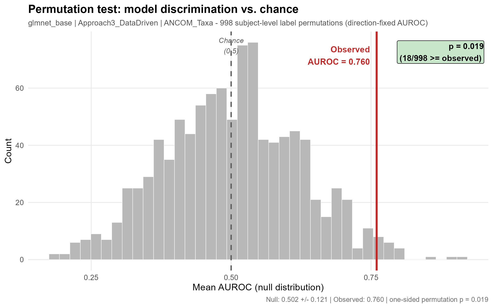

# Machine Learning Models for Preterm Birth Prediction Using Vaginal Microbiome Profiles in a Mexican Cohort

[](https://github.com/martinruhle/Mexican-PretermBirth-analysis/actions/workflows/check-code.yml)
[](https://opensource.org/licenses/MIT)

> ## 📌 Read this first if you arrived from the article
>
> **After publication, this analysis code was reviewed and several methodological updates were
> made; some of them change the reported numbers.** The published article is not being amended —
> **this repository is the authoritative record of the updated analysis.**
>
> ### → **[docs/UPDATE_SINCE_PUBLICATION.md](docs/UPDATE_SINCE_PUBLICATION.md)** — what changed, why, and by how much
>
> Short version: the best-performing model is no longer Random Forest with the full microbiome at
> AUROC 0.813, but **elastic net with ANCOM-BC2-selected taxa at AUROC 0.760**, and the
> permutation test that supports it — since rebuilt — now gives **p = 0.019**. The study design,
> cohort, data and biological question are unchanged. The current numbers are in
> [Results](#results-current) below.

**Status:** Published in *Frontiers in Global Women's Health* —
[doi:10.3389/fgwh.2026.1799518](https://doi.org/10.3389/fgwh.2026.1799518). Analysis code updated
since publication (see the box above).

---

## Citation

```
Ruhle, M., et al. (2025). Leakage-aware machine learning reveals structured clinical and vaginal
microbiome patterns associated with preterm birth in a Mexican cohort.
Front. Glob. Women's Health 7:1799518. doi: 10.3389/fgwh.2026.1799518
```

If you use the **updated** results, please also point readers to
[`docs/UPDATE_SINCE_PUBLICATION.md`](docs/UPDATE_SINCE_PUBLICATION.md), since they differ from
the article. Machine-readable metadata is in [`CITATION.cff`](CITATION.cff).

---

## Contents

- [What this is](#what-this-is)
- [Results (current)](#results-current)
- [Limitations](#limitations)
- [Run the pipeline on the example data](#run-the-pipeline-on-the-example-data)
- [Use the pipeline with your own data](#use-the-pipeline-with-your-own-data)
- [What each part of the repository does](#what-each-part-of-the-repository-does)
- [Methods, as implemented](#methods-as-implemented)
- [Data](#data)
- [Reproducibility](#reproducibility)
- [Tests and continuous integration](#tests-and-continuous-integration)
- [Contributing](#contributing)
- [License](#license)
- [Contact](#contact)
- [Acknowledgments](#acknowledgments)

---

## What this is

A nested cross-validation pipeline that predicts preterm birth (PTB, delivery before 37 completed
weeks) from vaginal microbiome profiles combined with clinical and nutritional variables, in a
Mexican pregnancy cohort. Most microbiome-based PTB prediction work has been done in populations
of European or African ancestry; this study addresses that gap for a Latin American cohort.

**Study design**

| | |
|---|---|
| Cohort | 43 pregnant women, Instituto Nacional de Perinatología, Mexico City |
| Samples | 110 longitudinal vaginal swabs, 16S rRNA V3–V4 sequencing |
| Outcome | Preterm birth (<37 weeks); 14 PTB cases (32.6% of subjects) |
| Models | Random Forest (`ranger`) and elastic net (`glmnet`), fixed hyperparameters |
| Validation | 5-fold nested CV, splits at the **subject** level, stratified by outcome |
| Combinations evaluated | 12 = 2 models × 3 clinical variable sets × 2 microbiome inputs |

The repository is organised as an installable R package (`ptbpredict`) plus the analysis that
uses it: the reusable engine lives in [`R/`](R/), the configuration in [`config/`](config/), and
the report-producing pipeline in [`analysis/`](analysis/).

---

## Results (current)

Real cohort data, 5 outer folds, subject-level splits stratified by outcome. All values are the
mean ± SD **across the 5 outer test folds**. Threshold-dependent metrics (sensitivity,
specificity) use the Youden threshold chosen on the inner validation split of each fold.

| Model | Clinical variable set | Microbiome input | AUROC | PRAUC | Sensitivity | Specificity |
|---|---|---|---|---|---|---|
| **Elastic net (glmnet)** | **3 — data-driven** | **ANCOM-BC2 taxa** | **0.760 ± 0.270** | 0.552 ± 0.173 | 0.667 ± 0.408 | 0.593 ± 0.180 |
| Random Forest | 3 — data-driven | ANCOM-BC2 taxa | 0.736 ± 0.147 | 0.611 ± 0.200 | 0.600 ± 0.365 | 0.407 ± 0.319 |
| Elastic net (glmnet) | 2 — literature | ANCOM-BC2 taxa | 0.724 ± 0.187 | 0.790 ± 0.189 | 0.267 ± 0.279 | 0.593 ± 0.319 |
| Random Forest | 1 — DREAM (minimal) | ANCOM-BC2 taxa | 0.718 ± 0.172 | 0.757 ± 0.179 | 0.567 ± 0.435 | 0.307 ± 0.317 |
| Elastic net (glmnet) | 2 — literature | Full microbiome | 0.682 ± 0.105 | 0.749 ± 0.159 | 0.400 ± 0.279 | 0.447 ± 0.218 |
| Random Forest | 2 — literature | ANCOM-BC2 taxa | 0.680 ± 0.163 | 0.707 ± 0.169 | 0.600 ± 0.435 | 0.453 ± 0.311 |
| Random Forest | 3 — data-driven | Full microbiome | 0.680 ± 0.201 | 0.653 ± 0.177 | 0.400 ± 0.279 | 0.573 ± 0.292 |
| Random Forest | 1 — DREAM (minimal) | Full microbiome | 0.660 ± 0.149 | 0.689 ± 0.143 | 0.400 ± 0.435 | 0.633 ± 0.380 |
| Random Forest | 2 — literature | Full microbiome | 0.649 ± 0.160 | 0.701 ± 0.140 | 0.467 ± 0.380 | 0.573 ± 0.292 |
| Elastic net (glmnet) | 1 — DREAM (minimal) | Full microbiome | 0.649 ± 0.191 | 0.685 ± 0.158 | 0.433 ± 0.279 | 0.460 ± 0.425 |
| Elastic net (glmnet) | 3 — data-driven | Full microbiome | 0.636 ± 0.221 | 0.575 ± 0.122 | 0.567 ± 0.149 | 0.653 ± 0.335 |
| Elastic net (glmnet) | 1 — DREAM (minimal) | ANCOM-BC2 taxa | 0.540 ± 0.098 | 0.730 ± 0.107 | 0.267 ± 0.279 | 0.753 ± 0.286 |

The three clinical variable sets and the two microbiome inputs are defined in
[Methods](#methods-as-implemented).

> **Note on the previous numbers.** The article reports a best model of Random Forest / data-driven
> clinical set / full microbiome at AUROC 0.813. That combination now scores **0.680**, mid-table
> (tied with another combination at the same AUROC) — a direct consequence of the updated CLR
> transformation. An **AUROC of 0.849 appeared in earlier versions of this README**; it came from a
> render made before contaminant filtering was applied and is superseded. See
> [`docs/UPDATE_SINCE_PUBLICATION.md`](docs/UPDATE_SINCE_PUBLICATION.md).

### Permutation test

A reviewer asked for evidence that the model's discrimination exceeds chance. The outcome labels
were permuted at the subject level 999 times, with the permuted labels propagated to **every**
place the outcome is consumed — including ANCOM-BC2 taxa selection — and the whole nested CV
re-run each time.

| | Value |
|---|---|
| Observed AUROC | **0.760** |
| Null distribution (999 permutations, 998 valid) | **0.502 ± 0.121** |
| Permutations reaching the observed value | 18 / 998 |
| **One-sided permutation p-value** | **0.019** |



The null is centred on 0.502, statistically indistinguishable from the 0.5 expected under no
signal, and 48.6% of null values fall below 0.5 — that is the check that the null is legitimate.
With the statistic used previously, the same data would have given p = 0.139.

The saved artefacts — null distribution, summary table, per-fold supplementary table and the
figure in both raster and vector form — are versioned in
**[`results/permutation_test/`](results/permutation_test/)** so the test can be inspected without
re-running it (≈3.6 h on 8 cores).

---

## Limitations

- **The p-value is conditional on model selection.** The model submitted to the permutation test
  is the best of the 12 combinations evaluated on the same subjects, so **p = 0.019 quantifies
  "this particular model beats chance", not "the best of 12 models beats chance", and it is not
  adjusted for having examined 12 combinations.** We report it unadjusted and state the
  conditioning explicitly rather than substituting an adjusted number we cannot justify: a naive
  Bonferroni adjustment (0.019 × 12 ≈ 0.23) would over-correct badly, because the 12 combinations
  are not independent tests — they share the same subjects, the same outer folds and largely the
  same features, so the effective number of independent comparisons is well below 12. Read the
  p-value as supporting evidence for the reported model, not as a family-wise significance claim.
- **Small sample.** 43 subjects, 14 preterm, 110 longitudinal samples. Each outer test fold holds
  7–9 subjects (2–3 preterm), so per-fold AUROC is inherently unstable; hence the wide standard
  deviations above. Differences between mid-table combinations should not be over-interpreted.
- **Exploratory, not clinically validated.** No external validation cohort. The results are
  hypothesis-generating.
- **AUROC orientation.** The pipeline reports AUROC computed with `pROC`'s automatic orientation.
  For the reported model this was verified fold by fold to be identical to a fixed orientation
  (0.760 either way); it has not yet been examined for the other 11 combinations. The permutation
  test uses a fixed orientation throughout, which is what makes its null valid.
- **Environmental taxa.** Some taxa recurrently selected by the differential-abundance step are
  common reagent contaminants. A contaminant filter is applied, but without sequenced negative
  controls (extraction and PCR blanks) technical and biological signals cannot be fully separated.

---

## Run the pipeline on the example data

`data/example/` contains **fully synthetic** data with the same structure as the real cohort, so
the pipeline can be run end to end without access to the restricted microbiome tables. The
numbers it produces are meaningless — the point is that all 12 combinations and every figure run.

**1. Clone and install dependencies** (exact pinned versions; the first install is slow, since
Bioconductor packages may be compiled from source):

```bash
git clone https://github.com/martinruhle/Mexican-PretermBirth-analysis.git
```

```r
# in R, from the repository root
install.packages("renv")
renv::restore()
```

`.Rprofile` activates `renv` automatically when you open the project. See
[`docs/INSTALL.md`](docs/INSTALL.md) if `renv::restore()` gives you trouble.

**2. Run it:**

```bash
PTB_PROFILE=example Rscript scripts/run_baseline.R
```

`PTB_PROFILE=example` selects the `example:` profile in
[`config/config.yml`](config/config.yml), which repoints the three input paths at
`data/example/` and inherits everything else from `default:`.

**3. What you get**, in `analysis/_output/` (untracked):

| File | Content |
|---|---|
| `baseline_postfix.html` | The full rendered report: cohort figures, PCA, feature-selection tables, the 12-combination performance table, ROC/PR curves, feature importance, session info |
| `baseline_postfix_metrics.csv` | The 12 combinations as numbers — AUROC, PRAUC, sensitivity, specificity, accuracy, balanced accuracy, threshold, Youden (mean and SD per combination) |
| `baseline_postfix_cv_summary.rds` | The same summaries as an R object |

Set `PTB_RUN_TAG=myrun` to change the output prefix.

**Runtime:** **≈12 minutes** — measured, not estimated: 11.8 min for a complete run on a Windows 11
laptop (R 4.4.2, restored `renv` library, single-threaded models). That covers all 12 combinations
end to end plus every figure; most of the time goes to running ANCOM-BC2 inside each fold. Budget
longer on a first run, when packages still have to be installed.

Rendering needs **pandoc**. RStudio and Quarto bundle it; `scripts/run_baseline.R` looks in the
usual install locations and sets `RSTUDIO_PANDOC` for you, but if it cannot find one it stops with
a clear message.

For a quicker check that the installation is sound — before committing twelve minutes to a full
run — use the test suite instead: see [Tests](#tests-and-continuous-integration).

---

## Use the pipeline with your own data

Nothing in `R/` is specific to this cohort. Adapting the pipeline to another dataset means editing
**two files only** — `config/config.yml` and `config/data_dictionary.csv` — plus placing your data
where the config points.

### 1. Prepare three input files

| Config key | What it must contain |
|---|---|
| `matrix_path` | One row per **sample**. Taxa columns as **relative abundances** (each row sums to ~1), plus the key columns and all clinical variables. This is the wide analysis matrix. |
| `abs_matrix_path` | The same rows and the same taxa columns, but as **integer read counts**. ANCOM-BC2 needs counts. |
| `metadata_path` | Longitudinal metadata for the cohort figures: subject id, sample id, outcome, gestational age at delivery, gestational age at sampling. |

Required key columns (names configurable under `columns:`): a subject id (`id`), a sample id
(`index`), a binary 0/1 outcome (`preterm`), gestational age at delivery (`sdg_parto`) and
gestational age at sampling (`sdg_visita`). The sample and subject keys must agree exactly between
the matrix and the metadata — the data contract checks this.

Two further clinical variables are referenced **by name** in the default configuration:
`edad_cronologicamujer` (maternal age) and `imc_pregestacional` (pre-pregnancy BMI). They appear in
the ANCOM-BC2 confounder formula (`feature_selection.ancombc.fix_formula`) and in the Approach 1
and 2 variable lists. Either provide columns with those names or rename them in `config.yml`.

### 2. Add a profile to `config/config.yml`

Copy the `example:` profile as a template. **Redefine the whole `data:` block** — profile
inheritance replaces `data:` wholesale rather than merging key by key:

```yaml
mylab:

  data:
    matrix_path:      "data/mylab/genus_rel.csv"
    abs_matrix_path:  "data/mylab/genus_counts.csv"
    metadata_path:    "data/mylab/metadata_long.csv"
    participant_path: null
    data_dictionary:  "config/data_dictionary.csv"
    microbiome_columns_from: "data_dictionary"
```

Everything else (`columns`, `approaches`, `preprocessing`, `cv`, `models`, `microbiome_options`,
`feature_selection`, `output`) is inherited from `default:`; override only what differs. Then run
with `PTB_PROFILE=mylab`.

### 3. Fill in `config/data_dictionary.csv`

This file is the **single source of truth for which columns are microbiome and which are
clinical**. There is no positional indexing and no name-prefix regex anywhere in the pipeline.
One row per column of your matrix:

```csv
variable,role,type,unit,required,description
id,subject_id,character,,yes,Subject identifier
index,sample_id,character,,yes,Longitudinal sample identifier
preterm,outcome,factor,0/1,yes,Preterm birth; positive level = 1
sdg_parto,gestational_age,numeric,weeks,yes,Gestational age at delivery
Lactobacillus,microbiome,numeric,relative_abundance,yes,Genus-level relative abundance
edad_cronologicamujer,clinical,numeric,years,yes,Maternal age
```

Valid `role` values in use: `subject_id`, `sample_id`, `outcome`, `gestational_age`, `microbiome`,
`clinical`. Every `role = microbiome` row must exist as a column in **both** the relative-abundance
and the count matrix, spelled identically (hyphens and `f__`/`o__`/`c__`/`d__` prefixes included —
they are read with `check.names = FALSE` precisely so they survive).

### 4. Check the contract before running

```r
cfg <- read_config("mylab")
d   <- load_dataset(cfg)
validate_input_data(d$matrix, d$metadata, cfg)
```

`validate_input_data()` fails loudly and specifically: missing required columns, a non-binary
outcome, a dictionary taxon absent from the matrix, taxa outside `[0, 1]`, and sample/subject keys
that disagree between matrix and metadata.

### Known reusability limits

Two constraints are known and not yet fixed. Both are in the exploratory figure code, not in the
modelling engine:

- **Subject and sample ids must be integer-like.** The PCA figure rebuilds its join key with
  `as.integer(rownames(...))`. Alphanumeric ids (`"S01_V1"`) become `NA` and the join fails. If
  your ids are alphanumeric, add an integer `index` column for the pipeline and keep your own ids
  in a separate column.
- **Every taxon needs at least 2 samples with a non-zero value.** The exploratory CLR uses
  `zCompositions::cmultRepl(method = "GBM")`, which cannot estimate its hyper-parameter for a
  taxon present in 0 or 1 samples. Drop ultra-rare taxa before running, or raise
  `preprocessing.prevalence_filter`.

---

## What each part of the repository does

```
Mexican-PretermBirth-analysis/
├── R/                     # the reusable engine (installable package `ptbpredict`)
├── analysis/              # the pipeline that produces the report
├── scripts/               # command-line entry points
├── config/                # configuration + data contract
├── data/                  # metadata, synthetic example, restricted raw (untracked)
├── tests/testthat/        # test suite, including no-leakage checks
├── results/               # versioned outputs
├── docs/                  # documentation
├── vignettes/             # narrative walkthrough of a full run
├── DESCRIPTION, NAMESPACE # package metadata (34 exported functions)
├── renv.lock, .Rprofile   # pinned dependencies
└── .github/workflows/     # continuous integration
```

### `R/` — the engine

Pure functions: everything enters through arguments, nothing is read from global state, no
`setwd()`, no absolute paths. Each function carries a roxygen block documenting its arguments and
return value — read them in the source files below.

| File | Responsibility |
|---|---|
| [`io.R`](R/io.R) | Read the config profile (`read_config`), the data dictionary, and the input matrices (`load_dataset`, `load_abs_matrix`); split columns into microbiome and clinical domains **by name** (`split_domains`, `microbiome_columns`) |
| [`data_contract.R`](R/data_contract.R) | `validate_input_data()` — the five contract checks described above |
| [`clr.R`](R/clr.R) | Compositional transform: `fit_clr_zerorepl()` learns per-taxon zero-replacement levels; `apply_clr_transform()` replaces zeros and applies a per-sample centred log-ratio |
| [`feature_selection.R`](R/feature_selection.R) | `run_ancombc_on_fold()` — ANCOM-BC2 differential abundance on a fold's training subjects only |
| [`threshold.R`](R/threshold.R) | `optimize_threshold_cv()` — Youden-optimal classification threshold from validation predictions |
| [`models.R`](R/models.R) | `build_model_specs()` — builds the parsnip specs for the **active** models from `config$models` (ignores `models_future`) |
| [`nested_cv.R`](R/nested_cv.R) | `train_with_nested_cv()` — the outer/inner loop for one combination: fold splitting, per-fold feature selection, recipe fitting, threshold selection, metrics, and out-of-fold predictions |
| [`plots.R`](R/plots.R) | Every figure builder used by the report; each takes already-computed data and returns a ggplot object (no model is ever refitted to draw a plot) |

### `analysis/`

- [`integrated_preterm_prediction_workflow.Rmd`](analysis/integrated_preterm_prediction_workflow.Rmd) —
  the pipeline and the manuscript-style report in one document: data loading and contract check,
  cohort description, prevalence and contaminant filtering, exploratory PCA and diversity, the
  three clinical variable sets, the nested CV loop over all 12 combinations, the performance table,
  ROC/PR curves and feature importance. Renders to HTML.
- `_output/` — where renders and metrics land. Untracked: regenerable scratch.

### `scripts/`

| Script | What it does |
|---|---|
| [`run_baseline.R`](scripts/run_baseline.R) | Renders the pipeline and additionally saves the 12 combinations as a numeric CSV, so two runs can be compared row by row. Honours `PTB_PROFILE` and `PTB_RUN_TAG`. This is the normal way to run the analysis. |
| [`permutation_test.R`](scripts/permutation_test.R) | The permutation test, single implementation. Three modes via `PTB_PERM_MODE`: `verify` (observed value + per-fold table), `run` (null distribution, parallel), `report` (p-value, tables and figure from a saved null). |
| [`generate_example_data.R`](scripts/generate_example_data.R) | Regenerates `data/example/` from a fixed seed. Taxa names and column roles come from `config/data_dictionary.csv`, never hardcoded. |
| [`sensitivity_nonindependence_weight.R`](scripts/sensitivity_nonindependence_weight.R) | Sensitivity analysis weighting samples by the inverse number of visits per subject. Note: still written against an earlier version of the engine's function signatures, so it needs updating before it will run; see [`CONTRIBUTING.md`](CONTRIBUTING.md). |

### `config/`

- [`config.yml`](config/config.yml) — profiles (`default:` = the Mexican cohort, `example:` =
  synthetic). Holds every path, column name, approach definition, preprocessing parameter, CV
  setting and model hyperparameter, each annotated with where it was verified.
- [`data_dictionary.csv`](config/data_dictionary.csv) — 167 variables with their `role`: 97
  microbiome, 66 clinical, plus the subject/sample/outcome/gestational-age keys.

### `results/`

- **[`permutation_test/`](results/permutation_test/)** — the permutation test artefacts and their
  own README. **Current.**
- **[`published_version/`](results/published_version/)** — the rendered report and figures from
  before these updates. **Archived, superseded** — kept so the published state stays
  inspectable. Please cite the current results instead.

### `docs/`

| Document | Content |
|---|---|
| **[`UPDATE_SINCE_PUBLICATION.md`](docs/UPDATE_SINCE_PUBLICATION.md)** | **The changelog between the article and this repository. Start here if you came from the paper.** |
| [`INSTALL.md`](docs/INSTALL.md) | Installation detail and troubleshooting |
| [`DATA_ACCESS.md`](docs/DATA_ACCESS.md) | How to request the restricted data |

---

## Methods, as implemented

This section describes the pipeline as implemented. Where the article's prose and the implementation
differ, the description here follows the implementation.

### Validation design

- **Outer loop:** 5 folds, split at the **subject** level (`id`), stratified by outcome, seed 123.
  Longitudinal samples from one subject never straddle a train/test boundary.
- **Inner loop:** a single stratified **70/30 split** of the outer-training subjects into
  inner-train and inner-validation. There is no inner *k*-fold.
- **What is fitted where** — the part that matters, stated exactly:

  | Step | Fitted on |
  |---|---|
  | ANCOM-BC2 taxa selection | the fold's **outer-training** subjects |
  | Approach-3 univariate clinical screening | the fold's **outer-training** subjects |
  | Preprocessing recipe (impute, standardise, filter) | **inner-train** (70%), then applied to inner-validation and outer-test |
  | Model fit | **inner-train** |
  | Classification threshold | **inner-validation** |
  | Everything reported | evaluated on **outer-test** |

  **Outer-test subjects never contribute to any selection or fitting decision** — that is the
  property the reported performance depends on, and it is what the test suite checks. The CLR is
  applied to all three splits, but it is row-local and outcome-blind (each sample is centred by its
  own taxa), so it moves no information between them.

  One nuance worth being explicit about: because feature selection uses the whole outer-training
  set, the inner-validation split is not fully independent of it. That does not affect the
  out-of-fold AUROC, but the threshold-dependent metrics (sensitivity, specificity) could be
  marginally optimistic, since the threshold is chosen on subjects that participated in selecting
  the features.
- **Metrics:** AUROC (primary), PRAUC (secondary, for class imbalance), plus sensitivity,
  specificity, accuracy and balanced accuracy at the selected threshold.

### Microbiome processing

1. **Prevalence filter** — genera present in ≥5% of samples: 97 → 59 genera.
2. **Contaminant filter** — 10 genera flagged as common reagent contaminants (Salter et al. 2014;
   Eisenhofer et al. 2019), listed in `preprocessing.contaminant_genera`: 59 → **49 genera**.
3. **Zero replacement** — per taxon, Bayesian-multiplicative (`zCompositions::cmultRepl`, GBM).
   Levels are learned once over the full microbiome, without ever consulting the outcome, and then
   passed in as an argument.
4. **Per-sample CLR** — each sample is centred by the geometric mean of its own taxa, so each
   transformed row sums to zero. Being row-local, the transform cannot leak information between
   train and test.

Two microbiome inputs are compared:

- **ANCOM-BC2 taxa** — differential abundance run **inside each fold**, on that fold's
  outer-training subjects only, on the count matrix, adjusting for maternal age and pre-pregnancy
  BMI; taxa with p < 0.10 are kept (`o__Chloroplast` excluded). Selected taxa legitimately differ
  across folds. If a fold finds nothing significant, it falls back to the 5 most abundant taxa.
- **Full microbiome** — all 49 filtered genera, plus Shannon diversity.

### Clinical variable sets

| Set | How variables are chosen |
|---|---|
| **1 — DREAM (minimal)** | Fixed, 2 variables: gestational age at sampling and maternal age. Mirrors the minimal adjustment of the DREAM Preterm Birth Prediction Challenge. |
| **2 — literature** | A fixed candidate list of evidence-based PTB risk factors, filtered by completeness (≥80% of subjects) and collinearity (\|r\| > 0.95), ranked by strength of evidence, top 10 retained. |
| **3 — data-driven** | Univariate screening **within each fold**: completeness filters (80% of subjects, 70% of samples), p < 0.30, top 15 candidates, collinearity resolution at \|r\| > 0.95, up to 10 features. |

Every combination therefore uses microbiome **and** clinical features together; the two microbiome
inputs and three clinical sets are what vary. (Earlier versions of this README summarised the design
as microbiome-only vs clinical-only vs combined; the description above reflects the implementation.)

### Preprocessing recipe (per fold, fitted on inner-train)

Zero-variance removal → correlation filter (\|r\| > 0.95) → novel/rare factor level handling →
**median/mode imputation** → standardisation → dummy coding → near-zero-variance removal.
Imputation is a single median/mode step inside the recipe (not multiple imputation).

### Models

Fixed hyperparameters, no tuning (the sample size does not support it):

- **Random Forest** (`ranger`): 500 trees, `mtry = 4`, `min_n = 10`, impurity importance,
  single-threaded for reproducibility.
- **Elastic net** (`glmnet`): `penalty = 0.01`, `mixture = 0.5`.

Three further model specifications (`xgboost`, `rpart`, RF-on-PCA) are kept in
`config.yml` under `models_future:` but are **not run** — with n = 43 they did not converge
reliably. Activating one is a configuration edit, but it changes the number of combinations and
requires a fresh baseline.

---

## Data

### In this repository

| Path | Content |
|---|---|
| `data/metadata/metadata_eugenia_long.csv` | De-identified longitudinal clinical measurements: demographics, anthropometrics, nutritional intake, complications, laboratory results, outcomes |
| `data/metadata/participant_data_clean.csv` | De-identified participant-level summary |
| `data/metadata/diccionario_variables_completo.csv` | Variable dictionary (Spanish/English) |
| `config/data_dictionary.csv` | The machine-readable data contract used by the pipeline |
| `data/example/` | Fully synthetic example dataset — see [`data/example/README.md`](data/example/README.md) |

Detailed variable-level documentation: [`data/README_DATA.md`](data/README_DATA.md).

### Not currently in this repository

- **Genus-level abundance tables** for the real cohort. The pipeline expects two files under
  `data/raw/` — relative abundances and integer counts — and that directory is untracked. To
  request them, see [`docs/DATA_ACCESS.md`](docs/DATA_ACCESS.md).
- **Raw 16S sequencing reads** are deposited in the NCBI Sequence Read Archive under BioProject
  **PRJNA1440471**.

`data/example/` exists so that neither of these blocks running the pipeline.

---

## Reproducibility

- **Pinned dependencies.** `renv.lock` records R 4.4.2 and the exact version of every package,
  including Bioconductor. `renv::restore()` reproduces the library; `.Rprofile` activates it.
- **Fixed seeds.** The pipeline seed is 123 (`cv.seed`), set for fold construction, the inner
  split and each model fit. The permutation test uses seeds 10001–10999; its p-value has been
  reproduced across independent runs.
- **No hidden state.** No absolute paths, no `setwd()`; paths resolve from the project root via
  `here::here()` and come from the config.
- **One model, many outputs.** Each figure and table is derived from the same trained model
  objects; nothing is refitted to draw a plot.
- **Session info** is printed at the end of every rendered report.

Known caveats: Bioconductor and compiled packages can differ in low-order digits across
platforms, and reproducing the real-cohort numbers requires the restricted abundance tables.

---

## Tests and continuous integration

```bash
Rscript -e 'testthat::test_dir("tests/testthat")'
```

Eight test files. Beyond unit tests of each engine function, three of them exist specifically to
keep the study's core guarantee honest:

- `test-ancom-leakage.R` — ANCOM-BC2 taxa selection uses only the fold's training subjects.
- `test-clr.R` — the CLR transform is row-local (perturbing other samples cannot change a given
  row) and scale-invariant.
- `test-leakage-permutation.R` — end-to-end: with permuted labels, performance collapses to
  chance. This is the slow one; it runs only when `PTB_RUN_SLOW_TESTS=1`.

```bash
PTB_RUN_SLOW_TESTS=1 Rscript -e 'testthat::test_dir("tests/testthat")'
```

That is the full suite — 56 passing checks, no skips — and it is what CI runs. It takes around 20
minutes, almost all of it in the end-to-end permutation test; without `PTB_RUN_SLOW_TESTS` the rest
finishes in a couple of minutes.

[GitHub Actions](.github/workflows/check-code.yml) runs on every push: restore the pinned library
→ install the package → run the **full** suite with `PTB_RUN_SLOW_TESTS=1` (the no-leakage test is
never allowed to skip in CI) → smoke-run the pipeline on `data/example/`.

---

## Contributing

Questions and issue reports: [GitHub Issues](https://github.com/martinruhle/Mexican-PretermBirth-analysis/issues).

Before proposing a code change, please read **[CONTRIBUTING.md](CONTRIBUTING.md)** — it documents
how to run the tests, the leakage invariants that must be preserved, and why the engine should
never be duplicated.

---

## License

The code is [MIT](LICENSE) licensed: free to use, modify and distribute, including commercially,
with attribution and without warranty. Terms for the cohort data are described separately in
[`docs/DATA_ACCESS.md`](docs/DATA_ACCESS.md).

---

## Contact

**Martin Ruhle** — Doctoral Program in Biomedical Sciences, Instituto Nacional de Medicina
Genómica, Mexico City · martinruhle@gmail.com

- Questions and issue reports: [GitHub Issues](https://github.com/martinruhle/Mexican-PretermBirth-analysis/issues)
- Data access: [`docs/DATA_ACCESS.md`](docs/DATA_ACCESS.md)

---

## Acknowledgments

Instituto Nacional de Perinatología (INPer), Mexico City, and the Biomedical Sciences Doctoral
Program.

Our deepest gratitude to the 43 pregnant women who participated in this study.

This work builds on methodological foundations from the DREAM Preterm Birth Prediction Challenge,
the microbiome and machine learning research communities, and the open-source R, tidymodels and
Bioconductor ecosystems.

---

**Last updated:** 2026-08-08
